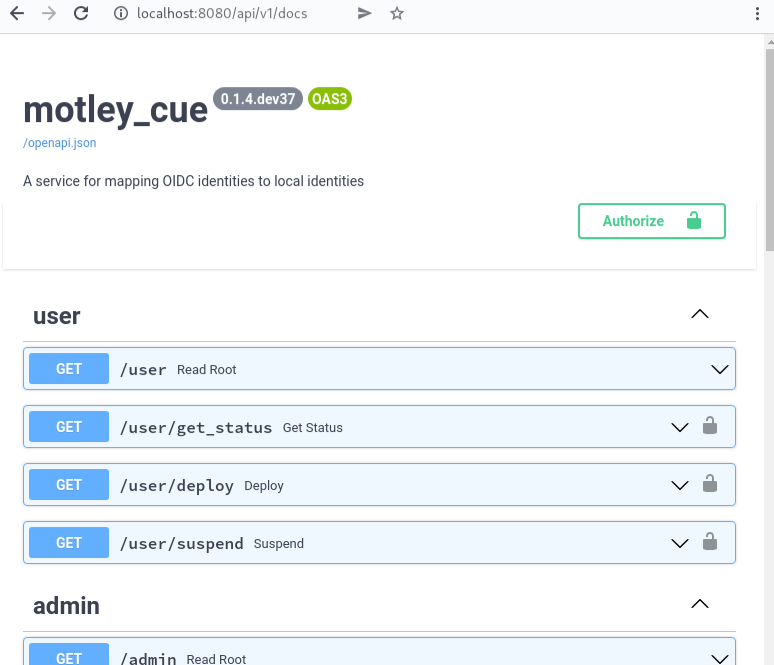

.. _configuration:

Configuration
=============

Two configuration files are required:

- ``motley_cue.conf``: contains configuration options relating to `authorisation`_.
- ``feudal_adapter.conf``: contains configuration options relating to the `account creation`_.

Configuration templates
-----------------------

Example config files explaining the options are included with ``motley_cue``. If you installed it via package manager, they will be located at ``/etc/motley_cue``.

- :ref:`motley_cue.conf <motley_cue_conf>`
- :ref:`feudal_adapter.conf <feudal_adapter_conf>`

.. warning::

    The default configuration might work well in most cases, but you have to configure the `authorisation`_ to enable any user to use your service.

Config files search paths
-------------------------

The config files will be searched in several places. Once one is found no further config files will be considered.

- **motley_cue.conf**

  - path configured via the environment variable ``MOTLEY_CUE_CONFIG``
  - ``./motley_cue.conf``
  - ``$HOME/.config/motley_cue/motley_cue.conf``
  - ``/etc/motley_cue/motley_cue.conf``

- **feudal_adapter.conf** (according to the `feudalAdapter documentation <https://git.scc.kit.edu/feudal/feudalAdapterLdf/-/tree/master#config-file-search-path>`_)

  - path configured via the environment variable ``FEUDAL_ADAPTER_CONFIG``
  - ``./feudal_adapter.conf``
  - ``$HOME/.config/feudal_adapter.conf``
  - ``$HOME/.config/feudal/feudal_adapter.conf``
  - ``/etc/feudal/feudal_adapter.conf``

.. _authorisation:

Authorisation configuration
---------------------------

You can configure who is allowed to use your service in ``motley_cue.conf``.

You can support multiple OPs and configure authorisation for each OP separately. There are three options to authorise users from the supported OPs:

- **authorise all**: allow all users from a trusted OP
- **individual**: authorise single users via their unique identifier given by the OIDC ``sub`` claim
- **VO-based**: authorise users that are members of a specific VO (or a set of VOs)

Below, a configuration block for one OP with default values. 

.. code-block:: ini

    [authorisation.<op shortname>]
    ## the complete URL for an OIDC provider. MANDATORY.
    ## this becomes the iss claim in an access token.
    op_url = <url>

    ## authorise all users from trusted OP, defaults to False if not specified
    authorise_all = False

    ## list of VOs whose users are authorised to use the service
    authorised_vos = []
    
    ## the OIDC claim containing the VOs specified above
    vo_claim = eduperson_entitlement
    
    ## how many VOs need to be matched from the list, valid options: all, one, or an int
    vo_match = one
    
    ## list of individual users authorised to use the service
    ## specified through OIDC 'sub', relative to the section's OP ('iss')
    authorised_users = []

    ## list of authorised admins specified by OIDC 'sub'
    authorised_admins = []

- The section name has to start with ``authorisation.``
- The OP URL must be specified
- A VO must be specified as a string or an entitlement according to the AARC guideline `AARC-G002 <https://aarc-community.org/guidelines/aarc-g002>`_ (or `AARC-G069 <https://aarc-community.org/guidelines/aarc-g069>`_, once it is published)
- An individual user must be specified by its unique identifier at the OP (the ``sub`` claim)

.. _account creation:

Account creation configuration
-------------------------------

This is handled by the feudal adapter in ``feudal_adapter.conf`` (see the `documentation <https://git.scc.kit.edu/feudal/feudalAdapterLdf>`_ for details).

Pay close attention to the following configurations:

- **backend**: how are the users managed locally (e.g. local UNIX accounts, LDAP, ...)
- **assurance**: specifying minimum acceptable assurance (according to the `REFEDS Assurance Framework <https://refeds.org/assurance>`_)
- **username generator**: how local usernames are generated for users (e.g. trying to honour incoming ``preferred username`` from the OP, or using pooled accounts with a custom prefix)

.. _additional_configurations:

Additional configurations
-------------------------

By default, the Swagger documentation for the REST API is disabled. You can enable it in ``motley_cue.conf``, and change its location:

.. code-block:: ini

  ## enable swagger documentation -- default: False
  enable_docs = True
  ## location of swagger docs -- default: /docs
  docs_url = /api/v1/docs

If ``motley_cue`` is running on ``localhost``, these settings will enable the interactive Swagger docs at http://localhost:8080/api/v1/docs:

