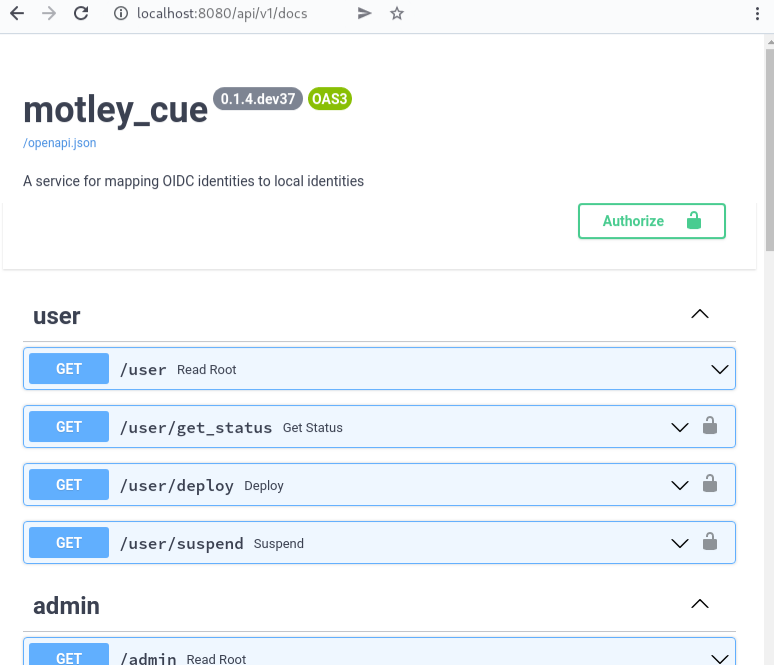

.. _configuration:

Configuration
=============

Two configuration files are required:

- ``motley_cue.conf``: contains configuration options relating to `authorisation`_.
- ``feudal_adapter.conf``: contains configuration options relating to the `account creation`_.

Optionally, you can configure additional settings in ``flaat.conf`` (see the `flaat documentation <https://flaat.readthedocs.io/en/latest/flaat/api/config.html>`_).

Configuration templates
-----------------------

Example config files explaining the options are included with ``motley_cue``. If you installed it via package manager, they will be located at ``/etc/motley_cue``.

- :ref:`motley_cue.conf <motley_cue_conf>`
- :ref:`feudal_adapter.conf <feudal_adapter_conf>`
- :ref:`flaat.conf <flaat_conf>`

.. warning::

    The default configuration might work well in most cases, but you have to configure the `authorisation`_ to enable any user to use your service.

Config files search paths
-------------------------

The config files will be searched in several places. Once one is found no further config files will be considered.

- **motley_cue.conf**

  - path configured via the environment variable ``MOTLEY_CUE_CONFIG``
  - ``./motley_cue.conf``
  - ``$HOME/.config/motley_cue/motley_cue.conf``
  - ``/etc/motley_cue/motley_cue.conf``

- **feudal_adapter.conf** (according to the `feudalAdapter documentation <https://codebase.helmholtz.cloud/m-team/feudal/feudalAdapterLdf/-/tree/master#config-file-search-path>`_)

  - path configured via the environment variable ``FEUDAL_ADAPTER_CONFIG``
  - ``./feudal_adapter.conf``
  - ``$HOME/.config/feudal_adapter.conf``
  - ``$HOME/.config/feudal/feudal_adapter.conf``
  - ``/etc/feudal/feudal_adapter.conf``

- **flaat.conf**

  - path configured via the environment variable ``FLAAT_CONFIG``
  - ``./flaat.conf``
  - ``$HOME/.config/flaat/flaat.conf``
  - ``/etc/flaat/flaat.conf``

.. _authorisation:

Authorisation configuration
---------------------------

You can configure who is allowed to use your service in ``motley_cue.conf``.

You can support multiple OPs and configure authorisation for each OP separately. There are three options to authorise users from the supported OPs:

- **authorise all**: allow all users from a trusted OP
- **individual**: authorise single users via their unique identifier given by the OIDC ``sub`` claim
- **VO-based**: authorise users that are members of a specific VO (or a set of VOs)

Below, a configuration block for one OP with default values. 

.. code-block:: ini

    [authorisation.<op shortname>]
    ## the complete URL for an OIDC provider. MANDATORY.
    ## this becomes the iss claim in an access token.
    op_url = <url>

    ## authorise all users from trusted OP, defaults to False if not specified
    authorise_all = False

    ## list of VOs whose users are authorised to use the service
    authorised_vos = []
    
    ## the OIDC claim containing the VOs specified above
    vo_claim = eduperson_entitlement
    
    ## how many VOs need to be matched from the list, valid options: all, one, or an int
    vo_match = one
    
    ## list of individual users authorised to use the service
    ## specified through OIDC 'sub', relative to the section's OP ('iss')
    authorised_users = []

    ## audience claim specific to this service (OPTIONAL); it can be a string or a list of strings
    ## if empty or not specified, audience checking will not be used for authorisation
    # audience = ssh_localhost

    ## list of authorised admins specified by OIDC 'sub'
    authorised_admins = []

    ## assurance-based shell tiers (opt-in, see below)
    assurance_prefix = https://refeds.org
    assurance_claims = [assurance, eduperson_assurance, acr]
    assurance_based_shell_tier_full =
    assurance_based_shell_tier_limited =
    assurance_based_shell_tier_restricted =
    assurance_based_shell_default_tier = full
    assurance_based_shell_max_tier =

- The section name has to start with ``authorisation.``
- The OP URL must be specified
- A VO must be specified as a string or an entitlement according to the AARC guideline `AARC-G002 <https://aarc-community.org/guidelines/aarc-g002>`_ (or `AARC-G069 <https://aarc-community.org/guidelines/aarc-g069>`_, once it is published)
- An individual user must be specified by its unique identifier at the OP (the ``sub`` claim)

Furthermore, you can also configure an **audience** for the service in order to restrict access to tokens that have been released for this specific audience (i.e., they contain the configured audience in the ``aud`` claim). The audience can be configured individually per-OP.

.. warning::

  Most OPs do not support requesting a specific audience for access tokens, in which case this setting is ignored. So far, only IAM allows requesting the audience.

.. _assurance-based shell tiers:

Assurance-based shell tiers
---------------------------

motley_cue can give users a different login shell depending on the identity assurance their token asserts (according to the `REFEDS Assurance Framework <https://refeds.org/assurance>`_, including MFA). It classifies each deployment into a **tier** and passes that tier to the feudal adapter, which maps it to a shell.

This does **not** reject anyone: every authorised user is still deployed, the tier only decides which shell they get.

+--------------------------------------+----------------+----------------------------------------------+
| Signals                              | Tier           | feudal_adapter.conf ``[backend.local_unix]`` |
+======================================+================+==============================================+
| MFA **and** ``profile/cappuccino``   | ``full``       | ``shell``                                    |
+--------------------------------------+----------------+----------------------------------------------+
| ``profile/cappuccino``, no MFA       | ``limited``    | ``shell_limited``                            |
+--------------------------------------+----------------+----------------------------------------------+
| neither                              | ``restricted`` | ``shell_restricted``                         |
+--------------------------------------+----------------+----------------------------------------------+

The feature is **opt-in**: with no tier expression configured, every user resolves to ``full`` and gets the default shell, i.e. behaviour is unchanged. All options live in the authorisation sections, so they can be set once in ``[DEFAULT]`` and overridden for any individual OP -- which is the point, since OPs differ in what assurance they can actually assert.

.. code-block:: ini

    [DEFAULT]
    assurance_based_shell_tier_full = https://refeds.org/profile/mfa & assurance/profile/cappuccino
    assurance_based_shell_tier_limited = assurance/profile/cappuccino
    assurance_based_shell_tier_restricted = *

    [authorisation.google]
    op_url = https://accounts.google.com/
    ## this OP cannot assert MFA -- cap it, rather than restating the expressions
    assurance_based_shell_max_tier = restricted

The three ``assurance_based_shell_tier_*`` options hold **expressions**, evaluated highest privilege first; the first one that matches wins. The grammar is ``E -> E "&" E | E "|" E | "(" E ")" | string``, where ``&`` binds stronger than ``|``. A string matches if the user's assurance set contains it verbatim **or** prefixed with ``assurance_prefix``, so both full REFEDS URLs and bare values (such as an ``acr`` of ``1``) can be matched. ``assurance_prefix`` defaults to the REFEDS *root*, ``https://refeds.org``, because the RAF profiles live under ``/assurance/`` while MFA does not -- a prefix of the ``/assurance/`` subtree alone would leave ``profile/mfa`` expanding to a URL no OP asserts. Note that a relative token which does not resolve never matches and fails silently, so if you narrow ``assurance_prefix``, re-check every expression; an absolute URL always works whatever the prefix. ``+`` matches if the user has any assurance claim at all, and ``*`` always matches -- use it for ``assurance_based_shell_tier_restricted`` so that no user falls through unclassified.

The remaining two options hold a **tier name** (``full``, ``limited`` or ``restricted``): ``assurance_based_shell_default_tier`` is used when no expression matches, and ``assurance_based_shell_max_tier`` caps the result. The cap can only ever lower a tier, never raise one.

The assurance set itself is the union of the values of every claim in ``assurance_claims``, collected from **all** available sources: the userinfo endpoint, the access token body (when it is a JWT) and token introspection.

Debugging a policy
~~~~~~~~~~~~~~~~~~

Every deployment logs one ``AUDIT`` record with the tier and the reason for it, whatever ``log_level`` is set to -- whether an expression matched, the user fell through to the default tier, or a cap lowered the result::

    AUDIT - Assurance tier 'restricted' for  @ <iss> (no tier expression matched, using default tier 'restricted')

When that is not enough -- typically after an OP changes what it asserts -- set ``log_level = DEBUG`` in ``[mapper]``. The evaluation then reports, per deployment:

- which of the ``assurance_claims`` was found in which source, and its values;
- the **claim names** each source carries, so a claim the OP has renamed or moved is visible (names only, never values);
- any configured claim found in **no** source;
- the resulting assurance set;
- for each tier in turn, its expression, whether it matched, and the verdict on every individual token.

That last line is usually the one that answers the question, because it shows both forms a relative token was tried as::

    DEBUG - Tier 'limited' for OP https://example.org: no match | expression: profile/cappuccino |
            'profile/cappuccino' = False (tried 'profile/cappuccino' and 'https://refeds.org/profile/cappuccino')

Here the token silently never matches: the cappuccino profile lives under ``/assurance/``, so it has to be written ``assurance/profile/cappuccino``. A relative token that does not resolve fails closed and says nothing at the default log level -- which is exactly what this output is for.

A complete, working example -- along with two ready-made tier shells -- is installed under ``/etc/motley_cue/examples/``.

.. _account creation:

Account creation configuration
-------------------------------

This is handled by the feudal adapter in ``feudal_adapter.conf`` (see the `documentation <https://codebase.helmholtz.cloud/m-team/feudal/feudalAdapterLdf>`_ for details).

Pay close attention to the following configurations:

- **backend**: how are the users managed locally (e.g. local UNIX accounts, `LDAP <https://codebase.helmholtz.cloud/m-team/feudal/feudalAdapterLdf/-/blob/master/LDAP.md>`_, ...)
- **username generator**: how local usernames are generated for users (e.g. trying to honour incoming ``preferred username`` from the OP, or using pooled accounts with a custom prefix)
- **shell**: the login shell given to new accounts, including the ``shell_limited`` and ``shell_restricted`` variants used by `assurance-based shell tiers`_

An `approval workflow <https://codebase.helmholtz.cloud/m-team/feudal/feudalAdapterLdf/-/tree/master#approval-workflow>`_ is supported as well, where local admins can approve or reject account creation requests. The notification system supported so far is email.

.. _additional_configurations:

Additional configurations
-------------------------

.. rubric:: One-time tokens

To enable SSH support for large access tokens (longer than 1k), you can enable the use of one-time tokens in the ``[mapper.otp]`` section in ``motley_cue.conf``.

Calling the ``/user/generate_otp`` endpoint will generate a shorter, one-time token and store it in a local, encrypted database. This token can then be used as an SSH password instead of the access token, and the ``/verify_user`` will be able to verify the username with this one-time token by retrieving the corresponding access token from the database.

You can also configure the location of the token database, the backend used, as well as the location of the encryption key.

.. code-block:: ini

  ############
  [mapper.otp]
  ############
  ## use one-time passwords (OTP) instead of tokens as ssh password -- default: False
  ## this can be used when access tokens are too long to be used as passwords (>1k)
  use_otp = True
  ##
  ## backend for storing the OTP-AT mapping -- default: sqlite
  ## supported backends: sqlite, sqlitedict
  # backend = sqlite
  ##
  ## location for storing token database -- default: /run/motley_cue/tokenmap.db
  # db_location = /run/motley_cue/tokenmap.db
  ## path to file containing key for encrypting token db -- default: /run/motley_cue/motley_cue.key
  ## key must be a URL-safe base64-encoded 32-byte key, and it will be created if it doesn't exist
  # keyfile = /run/motley_cue/motley_cue.key

.. rubric:: Swagger docs

By default, the Swagger documentation for the REST API is disabled. You can enable it in ``motley_cue.conf``, and change its location:

.. code-block:: ini

  ## enable swagger documentation -- default: False
  enable_docs = True
  ## location of swagger docs -- default: /docs
  docs_url = /api/v1/docs

If ``motley_cue`` is running on ``localhost``, these settings will enable the interactive Swagger docs at http://localhost:8080/api/v1/docs:

Privacy policy
--------------

We provide a default privacy statement that you can use when running motley-cue.

When installing from Linux packages, the privacy statement is installed in:

.. code-block:: bash

  /etc/motley_cue/privacystatement.md

To run the service, you must configure the service contact information in the ``[privacy]`` section of ``motley_cue.conf``:

.. code-block:: ini

  #########
  [privacy]
  #########
  ## configuration related to privacy policy
  ##
  ## contact information for service operator to be included in privacy policy -- default: None
  ## this is an email address and MUST be filled in
  # privacy_contact = None
  ##
  ## privacy policy location (markdown file) -- default: /etc/motley_cue/privacystatement.md
  # privacy_file = /etc/motley_cue/privacystatement.md

You can also modify the privacy statement to fit your organisation's needs by editing the markdown file directly.

The privacy statement can be retrieved using the REST API from the the ``/privacy`` endpoint.
